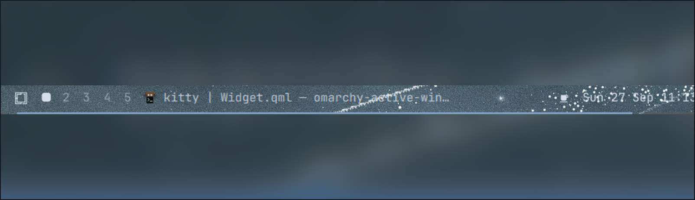
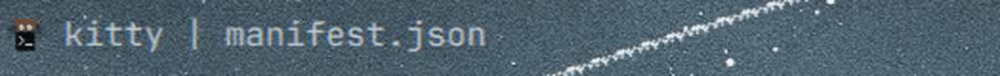

# Active Window Logo



A bar widget for [Omarchy](https://omarchy.org) that shows the focused window —
its **app icon, app name, and window title** — right in the bar.



<sub>The animation is a real screen recording of the widget reacting to focus
changes on an Omarchy desktop. Long titles elide automatically.</sub>

## Why

Omarchy already ships a built-in `omarchy.active-window` widget that shows the
raw window title. This plugin is a small, drop-in upgrade over it:

|                              | Built-in `omarchy.active-window` | Active Window Logo |
| ---------------------------- | -------------------------------- | ------------------ |
| App icon                     | –                                | ✅                 |
| App name from `.desktop`     | –                                | ✅                 |
| Collapses redundant titles   | –                                | ✅                 |
| Hover tooltip                | Title only                       | App name + title   |
| Long-title eliding           | ✅                               | ✅                 |
| Configurable `maxWidth`      | ✅                               | ✅                 |
| Click to focus / close       | ✅                               | ✅                 |

The app name matters most when several windows share a generic title. Two
terminals both titled `~` or two files both called `Work` become
`Kitty | ~` and `Files | Work`, so you can tell them apart at a glance
instead of guessing from the title alone.

## Features

- **Icon + name + title** in one theme-matched label.
- **Left-click** focuses the window, **middle-click** or **right-click** closes it.
- Resolves real app names and icons from `.desktop` entries via
  `DesktopEntries`, with a generic icon fallback so it never renders broken.
- Elides long titles and **collapses duplicates** — if the title already
  matches the app name, it shows the name only.
- Hides itself when nothing is focused and in vertical bars, so it never
  leaves an empty gap.
- Fully theme-reactive: every colour, font, and spacing value comes from
  Omarchy's `Color` / `Style` singletons, so theme switches restyle it live.

## Install

```sh
omarchy plugin add https://github.com/kaibur02/omarchy-active-window-logo.git --enable
```

## Usage

The widget is added to the bar's `left` section by default and shows the
focused window as `App Name | Window Title`.

| Input            | Action                    |
| ---------------- | ------------------------- |
| Left-click       | Focus the window          |
| Middle-click     | Close the window          |
| Right-click      | Close the window          |
| Hover            | Tooltip with name + title |

## Configure

```sh
# Cap the label width (default 260px) to give the bar more or less room.
omarchy bar set io.github.kaibur02.omarchy-active-window-logo maxWidth 320

# Move it to a different bar section.
omarchy bar move io.github.kaibur02.omarchy-active-window-logo --after omarchy.menu
```

## Remove

```sh
omarchy plugin remove io.github.kaibur02.omarchy-active-window-logo
```

## Dependencies

This plugin has **no external dependencies**.

- Nothing is downloaded, built, or installed at install time.
- No package manager, installer, or build system is used.
- No bundled binaries or executables are shipped — the repository contains
  only a `manifest.json`, one QML file, and documentation.
- The plugin performs no privileged operations and requires no elevated
  access. It runs as your normal user inside `omarchy-shell`, alongside every
  other bar widget.
- No network access, no background services, and no writes outside the
  plugin folder.

Everything it uses (`Quickshell`, `ToplevelManager`, `DesktopEntries`,
`Color`, `Style`) already ships with Omarchy.

## Details

- Pure QML + manifest. The whole widget is one declarative file with no
  imperative logic, timers, or state machine.
- Runs entirely inside `omarchy-shell` as an unsandboxed QML plugin with
  standard user permissions (the norm for Omarchy plugins).
- Reads only the focused window's `appId` and `title`, and resolves icons via
  `DesktopEntries` and `Quickshell.iconPath`. That is the entire data surface.
- Window management happens only in response to your own clicks; the widget
  never acts on its own.
- Installing only clones this repository and adds the plugin ID to your own
  `~/.config/omarchy/shell.json`. It never overwrites existing user
  configuration, and `omarchy plugin remove` undoes it.

## Compatibility

- Requires **Omarchy** with an `omarchy-shell` bar — this is an Omarchy bar
  widget and does not apply to other setups.
- Uses the Quickshell/Wayland APIs and the Omarchy QML modules
  (`BarWidget`, `ToplevelManager`, `DesktopEntries`, `Style`), targeting
  plugin `schemaVersion: 1`.
- Works alongside the built-in `omarchy.active-window` if you enable both.
- You can check the plugin without installing it:
  `omarchy plugin validate <repo-dir>`

## Files

| File            | What                          |
| --------------- | ----------------------------- |
| `manifest.json` | Omarchy plugin manifest       |
| `Widget.qml`    | Bar widget (icon + title)     |
| `preview.png`   | Marketplace preview screenshot |
| `demo.gif`      | Live demo of the widget       |
| `LICENSE`       | MIT license                   |
| `CHANGELOG.md`  | Release history               |

## License

MIT — see [LICENSE](LICENSE).
